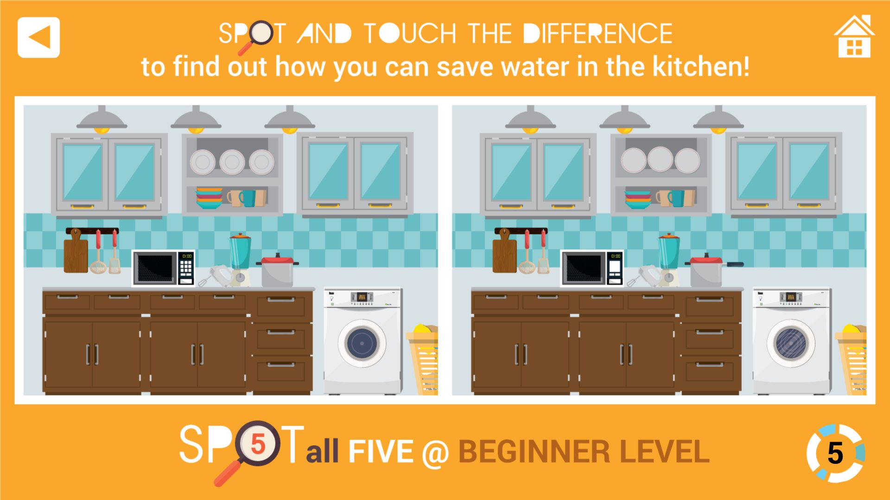

# 🌊 Water Guru – Spot and Touch The Difference

Challenge yourself to **spot the environmental differences** in various eco-themed scenes!  
An interactive touchscreen game designed to promote environmental awareness through play.
  
👉 [Play The Game](https://demo.schoolapp.sg/waterguru)  
📺 [Watch on YouTube](https://www.youtube.com/watch?v=0c_k-dbWV7w)  
📘 [Project Page](https://schoolapp.sg/project/marsiling-secondary-school-environmental-hub/)

---

## 📌 Overview

**Water Guru – Spot and Touch The Difference** is an educational game that engages players in identifying visual changes across two eco-scenes. Developed for **Marsiling Secondary School's Environmental Hub**, the game teaches sustainability concepts in a fun, interactive way.



### 🔍 Features

- 🖼️ Eco-themed spot-the-difference gameplay  
- 📱 Touchscreen-optimized for kiosks and tablets  
- 🔄 Replayable with randomized differences  
- 🎓 Environmentally educational cues and feedback  
- 🧠 Suitable for students and the general public  

---

## 🧱 Tech Stack

- HTML5, CSS3, JavaScript

---

## 🚀 Getting Started

To run locally:

```bash
git clone https://github.com/kennykee/water-guru.git
cd water-guru
open index.html
```

## License
